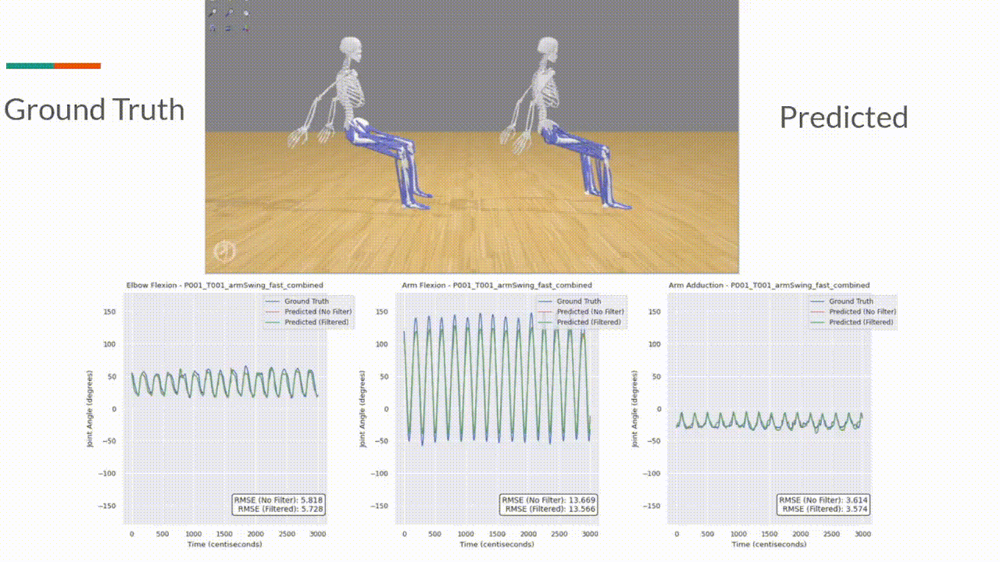
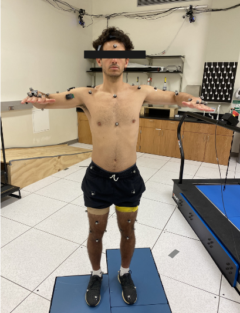
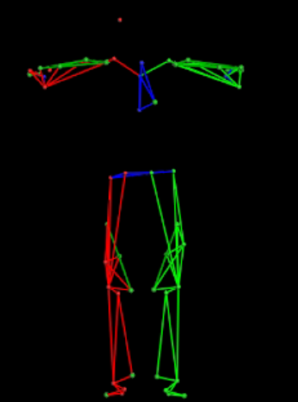
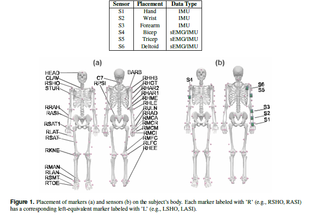
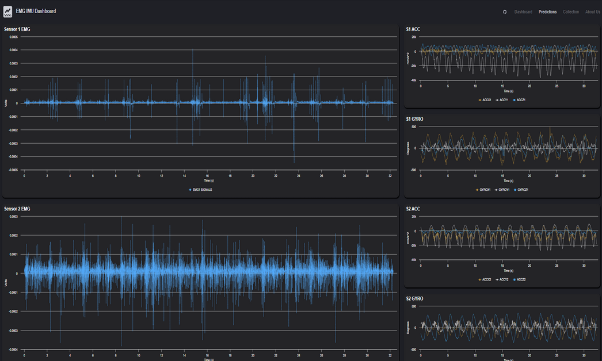
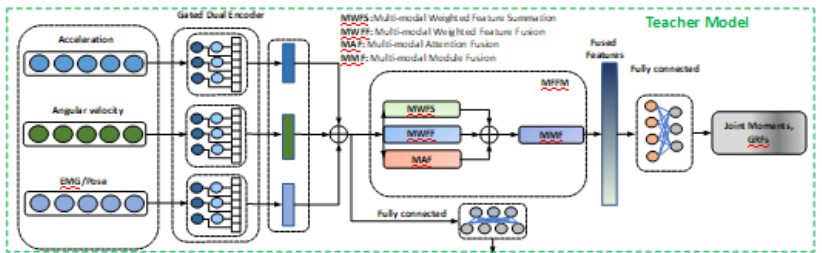

# Upper-Body Joint-Kinematics Prediction from Wearable IMU and sEMG

Deep-learning models that estimate upper-limb joint angles (elbow and shoulder flexion/adduction)
from body-worn inertial (IMU) and surface electromyography (sEMG) sensors, and a study of how well
those models generalize to people they were not trained on. All models are trained and evaluated on
the **ULTRA-MoCap** dataset.

<p align="center">
  <br>
  <em>Predicted joint kinematics tracked against optical motion-capture ground truth during movement.</em>
</p>

---

## Summary

Optically-tracked joint angles are accurate but require a lab. The goal here is to recover the same
joint angles from a wearable sensor set alone. This repository contains the modeling experiments built
on ULTRA-MoCap and reports two findings:

- **Within a subject, the problem is largely solved.** With a held-out subject's *own* trials, the
  baseline model reaches roughly **5 degrees RMSE** and **PCC 0.99**.
- **Across subjects, it is not.** On a completely held-out subject (leave-one-subject-out), the same
  model degrades to roughly **15 degrees RMSE** and **PCC 0.72** — and a broad battery of
  domain-adaptation methods does **not** meaningfully close that gap. A well-tuned baseline is hard to
  beat; the best subject-invariance variant improves cross-subject RMSE by under one degree, and a
  control that disables the adaptation mechanism performs just as well.

The work spans two questions: **cross-subject generalization** (the main focus) and **sensor
distillation** (training with the full lab rig, then deploying with fewer sensors).

---

## Dataset: ULTRA-MoCap

ULTRA-MoCap is a multimodal dataset of synchronized **IMU**, **sEMG**, and **optical motion-capture**
recordings of upper-body movement across **13 subjects**, with joint angles reconstructed from the
marker-based capture serving as ground truth.

<p align="center">
  
  <br>
  <em>Optical marker set on the subject (left) and the reconstructed skeletal model used to compute
  ground-truth joint angles (right).</em>
</p>

<p align="center">
  <br>
  <em>Co-located optical markers, IMUs, and sEMG electrodes used during collection.</em>
</p>

<p align="center">
  <br>
  <em>Example synchronized sensor streams (IMU accelerometer and gyroscope, sEMG) used as model input.</em>
</p>

The dataset is published in *Scientific Data*: **[ULTRA-MoCap: A Multimodal IMU and sEMG Dataset for
Upper Body Joint Kinematics Analysis](https://doi.org/10.1038/s41597-026-06687-5)**
(DOI: `10.1038/s41597-026-06687-5`). The raw subject recordings are IRB-restricted and are **not**
included in this repository; see the paper for access terms.

---

## Problem and evaluation

The task is continuous regression of upper-limb joint angles from a window of wearable-sensor signals.
The central question is generalization across people: anatomy, sensor placement, and movement style
differ between subjects, so a model that fits seen subjects well can still transfer poorly.

Evaluation uses **leave-one-subject-out (LOSO)** over the 13 subjects. Two regimes are distinguished
throughout:

- **Within-subject** — the validation split, i.e. held-out *trials* of the *training* subjects.
- **Cross-subject** — the test split, i.e. a subject withheld from training entirely.

Reported metrics are RMSE in degrees, NRMSE, and per-channel Pearson correlation (PCC).

---

## Approach

### One shared pipeline

<p align="center">
  <br>
  <em>Multi-branch teacher: per-modality encoders fused by a gating module, trained to regress joint angles.</em>
</p>

Every experiment is a variant of a single pipeline:

```
raw HDF5  ->  windowed shards (acc, gyr, emg, joints)  ->  multi-branch teacher  ->  joint angles
              (DataSharder)        (ImuJointPairDataset)   (Encoder_1 / Encoder_2 + GatingModule)
```

The teacher encodes the IMU accelerometer, IMU gyroscope, and sEMG streams in separate recurrent
encoders and fuses them with a gating/attention module. The notebooks under `experiments/` are an
iteration archive: each is this pipeline with one component changed (loss, normalization, backbone,
adaptation method, or held-out subject), re-run as a separate experiment.

### Two questions

1. **Cross-subject generalization (focus).** A LOSO benchmark paired with a battery of
   subject-invariance methods — adversarial / DANN gradient reversal, MMD alignment, per-subject
   normalization, self-supervised pretraining, prototypical networks, and feature modulation — across a
   model zoo (LSTM/GRU teacher, temporal-convolution, iTransformer, Mamba state-space, diffusion-policy
   regression), plus a forecasting variant.

2. **Sensor distillation.** A teacher trained on the full rig is distilled into students that use
   progressively fewer IMUs (1 to 4) via combined knowledge-and-sensor distillation
   (`experiments/Vanilla_SD_Experiments`, `experiments/LNN_SD_Models`) — the "train with the lab setup,
   deploy with a minimal wearable" setting.

---

## Results

Numbers below are aggregated from **478 leave-one-subject-out runs** logged to Weights & Biases
(targets: `elbow_flex_r`, `arm_flex_r`, `arm_add_r`; degrees). They are the authoritative aggregates,
not the leftover cell outputs in individual notebooks. The complete 33-configuration battery is in
[`results/comparison.csv`](./results/comparison.csv); a curated discussion is in
[`results/comparison.md`](./results/comparison.md).

### The within- versus cross-subject gap (baseline model)

| Joint | Within-subject RMSE / PCC | Cross-subject RMSE / PCC |
|---|---|---|
| `elbow_flex_r` | 4.68 deg / 0.99 | 15.30 deg / 0.71 |
| `arm_flex_r` | 7.45 deg / 0.99 | 20.26 deg / 0.87 |
| `arm_add_r` | 3.98 deg / 0.98 | 9.37 deg / 0.69 |
| **Overall** | **5.06 deg / 0.99** | **15.40 deg / 0.72** |

The model predicts seen subjects almost perfectly and loses roughly 3x RMSE on an unseen subject. Every
method below inherits this gap.

### Method comparison (cross-subject LOSO)

| Method | LOSO folds | Within-subject RMSE / PCC | Cross-subject RMSE / PCC |
|---|---|---|---|
| Baseline (multi-branch teacher) | 13 | 5.06 / 0.99 | **15.40 / 0.72** |
| Smoothed ground-truth joints | 13 | 5.32 / 0.99 | 14.62 / 0.76 |
| Gradient reversal (DANN) | 13 | 5.69 / 0.98 | 14.80 / 0.77 |
| DANN architecture, reversal disabled (control) | 13 | 5.43 / 0.99 | 14.49 / 0.77 |
| IMU-only (sEMG removed) | 13 | 5.46 / 0.99 | 14.76 / 0.76 |
| Learnable per-output bias | 13 | 5.36 / 0.99 | 14.76 / 0.76 |
| Longer input window | 7 | 5.63 / 0.99 | 18.74 / 0.84 |
| Temporal-conv, single-timestep | 8 | 2.66 / 1.00 | 16.53 / 0.57 |
| L1 weight regularization (lambda = 1e-3) | 13 | 23.75 / 0.58 | 23.55 / 0.40 |
| iTransformer | 2 | 37.55 / 0.34 | 31.45 / 0.05 |

*RMSE in degrees; PCC is the per-channel Pearson correlation. Within-subject is the validation split,
cross-subject is the held-out subject.*

### What the comparison shows

- **Domain adaptation does not close the gap.** The best subject-invariance variants reach about
  14.5 to 14.8 degrees, under one degree better than the 15.40-degree baseline. Critically, a control
  that keeps the DANN architecture but **disables gradient reversal matches the version with it
  enabled** — so the small gain comes from the incidental architecture change, not the adaptation
  mechanism.
- **sEMG contributes little to cross-subject transfer.** Removing EMG (IMU-only) lands within noise of
  the full rig, which is relevant to the minimal-wearable goal.
- **Heavier regularization and a plain transformer backbone hurt.** L1 degrades monotonically with its
  weight, and the iTransformer fails to fit (one LOSO fold diverged).
- **Per joint,** `arm_flex_r` is the hardest to transfer (about 20 degrees RMSE despite PCC 0.87 — a
  correlated but offset error), while `arm_add_r` is the easiest (about 9 degrees).

---

## Repository layout

```
README.md                  this file
media/                     figures and the overview animation
results/
  comparison.md            curated cross-subject comparison and discussion
  comparison.csv           full 33-configuration battery (within / cross RMSE and PCC)
experiments/               iteration archive: variants of the shared pipeline
  Teacher_Regression_Benchmarks/    LOSO benchmark + domain adaptation, SSL,
                                     prototypical, feature modulation, forecasting
  Adversarial_Training_Clustering/  adversarial subject-invariance and subject clustering
  OpenSim_Experiments/              alternate OpenSim joint-label models (within and cross-subject)
  Diffusion_Models/                 diffusion-policy regression and a Mamba state-space model
  Vanilla_SD_Experiments/           baseline teacher and teacher to 1-4 IMU student distillation
  LNN_SD_Models/                    liquid neural network (LTC/CfC) teacher and distillation
```

**Where to start in `experiments/`:**
[`Teacher_Regression_Benchmarks/regression_benchmark.ipynb`](./experiments/Teacher_Regression_Benchmarks/regression_benchmark.ipynb)
is the cleanest cross-subject benchmark, and
[`Vanilla_SD_Experiments/Vanilla_SD.ipynb`](./experiments/Vanilla_SD_Experiments/Vanilla_SD.ipynb)
is the full teacher-to-student sensor-distillation pipeline. See
[`experiments/README.md`](./experiments/README.md) for a per-folder guide.

---

## Limitations and scope

- **Thirteen subjects.** Cross-subject estimates are averaged over 13 leave-one-out folds; with a cohort
  this size, the cross-subject numbers carry real uncertainty.
- **Raw data is not included.** The ULTRA-MoCap recordings are IRB-restricted; only modeling code is in
  this repository.
- **`experiments/` is research code, not a packaged library.** It is the iteration history of one
  pipeline. The authoritative results are the Weights & Biases aggregates summarized in `results/`,
  not the individual notebooks' leftover outputs.
- **"Within-subject" here means unseen trials of seen subjects** (the validation split), not
  individually personalized single-subject models.

---

## Citation

If you use this dataset or code, please cite the ULTRA-MoCap paper:

```bibtex
@article{fritsche2026ultramocap,
  title   = {ULTRA-MoCap: A Multimodal IMU and sEMG Dataset for Upper Body Joint Kinematics Analysis},
  author  = {Fritsche, Oliver and Camacho, Steven and Hossain, Md Sanzid Bin and Halfpenny, Tyler
             and Arciniegas, Carlos and Dranetz, Joseph and Hadley, Dexter and Guo, Zhishan and Choi, Hwan},
  journal = {Scientific Data},
  volume  = {13},
  pages   = {622},
  year    = {2026},
  doi     = {10.1038/s41597-026-06687-5}
}
```
