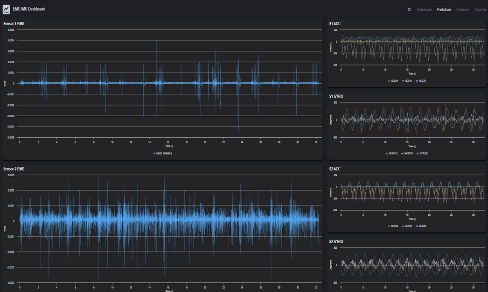

# REAL Lab Kinematics Prediction Experiments

## Overview
  

This repository contains experiments from the REAL lab focused on predicting joint kinematics from wearable motion data. We integrate multiple sensors (IMUs, EMG) and estimate joint angles (like elbow/arm flexion) using deep learning approaches. The included scripts and notebooks demonstrate different training paradigms—LSTM/GRU encoders, gating modules, adversarial training, teacher-student models, and more.

---

## Data Collection Pipeline

### Marker Set & Vicon Wireframe  
<div align="center">
     
      
</div>  

To track motion accurately, we use a marker-based motion capture system. The first image shows real-world marker placement, while the second illustrates how these points are reconstructed into a wireframe model for precise joint angle estimation.

### Pose Detection  
<div align="center">
      
</div>  

Pose detection models analyze skeletal movement by identifying joint locations and calculating angles dynamically. Imagine drawing a stick figure with labeled joints over a moving person—this is the core challenge of kinematic prediction.

### Marker & Sensor Placement  
<div align="center">
      
</div>  

Each experiment integrates IMUs and EMG sensors along with optical motion capture markers to ensure accurate joint angle estimation. This image shows the exact placement of sensors used for data collection.

### Model Diagram  
<div align="center">
      
</div>  

The processing pipeline takes raw motion capture and wearable sensor data as input, passing it through deep learning models to predict kinematic outcomes.

### Sensor Data Example  
<div align="center">
      
</div>  

This visualization shows the actual signals recorded from sensors, which serve as inputs for training models to predict joint angles and motion patterns.

---

## Folder Descriptions

1. **Vanilla_SD_Experiments**  
   Various loss functions (RMSE, NRMSE), data smoothing, and grid-search training are tested here.

2. **LNN_SD_Models**  
   Experiments with LNN (Liquid Neural Network) combined with our baseline model. These explore advanced neural structures for improved kinematic predictions.

3. **OpenSim_Experiments**  
   Experiments which shift to using a different OpenSim model.

4. **Teacher_Regression_Benchmarks**  
   Teacher-student approach notebooks, exploring domain adaptation (gradient reversal, MMD) and multi-channel data fusion. Benchmarks track how well teacher models guide simpler student models.

5. **Adversarial_Training_Clustering**  
   Uses adversarial training to reduce subject bias and investigate subject clustering for domain-invariant feature extraction.

7. **Diffusion_Models**  
   Explores diffusion-based generative/regression models for time-series, aiming to capture complex temporal dynamics from IMU/EMG inputs.

---

## Main Script Highlights

1. **Imports & Config**  
   - Sets up seeds, devices, and data paths.  
   - Defines sensor channels for IMU/EMG/joints.

2. **Data Sharder**  
   - Reads the raw HDF5 data, windows it (with overlap), and saves CSV shards.

3. **Custom Dataset**  
   - Loads the windowed CSVs as `(acc, gyr, emg, joints)` samples, applying any transforms.

4. **Models**  
   - RNN-based encoders, gating modules, teacher-student networks, etc.  
   - Specialized “teacher” architecture for multi-channel data.

5. **Loss & Evaluation**  
   - RMSE with optional L1 regularization.  
   - Metrics like PCC for each channel.

6. **Training & Checkpoints**  
   - Standard training loop with early stopping and best-model checkpoints.  
   - Optionally includes curriculum learning or adversarial domain adaptation.

---

## Getting Started

1. **Clone** this repository:
   ```bash
   git clone https://github.com/oliverkristianfritsche/UpperBody_Kinematics_Prediction.git
   ```
